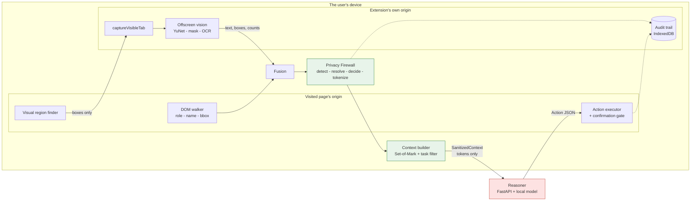
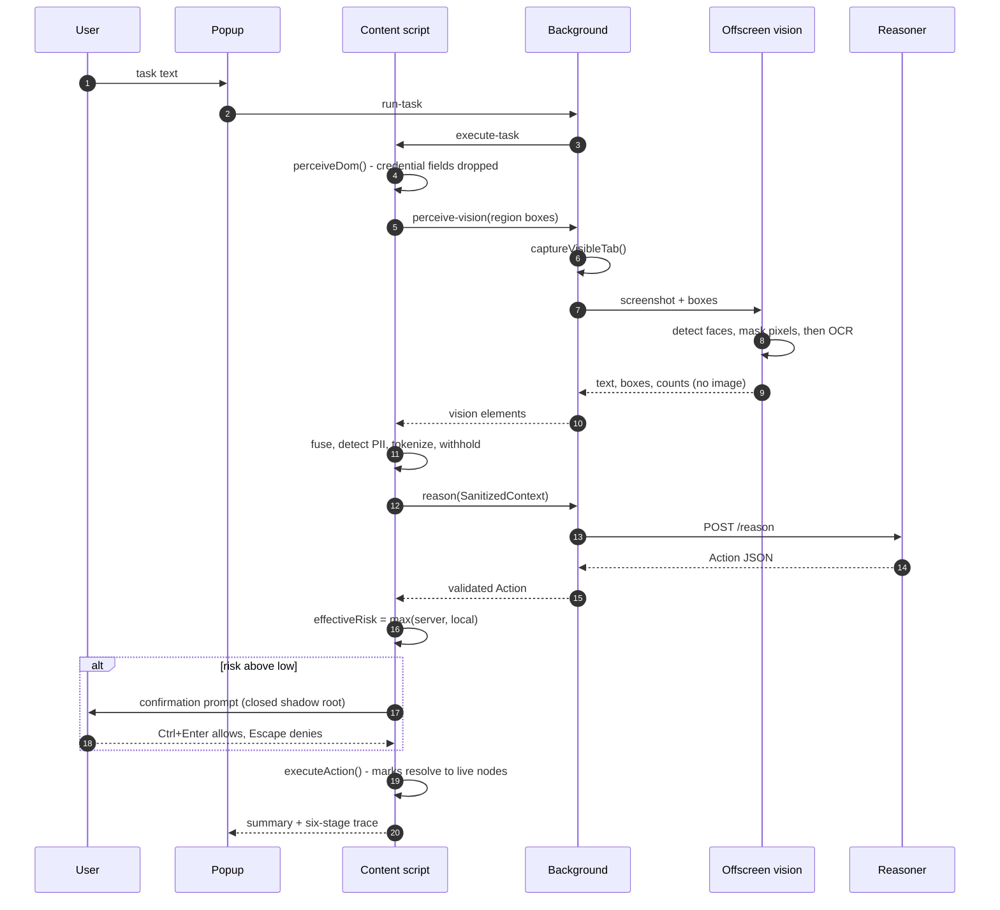

# PrivAgent Architecture

Last verified: 2026-09-06 against the Stage 2 build. This document describes what is
**built**; anything not yet built is marked as such. The diagrams here are the ones the pitch
deck uses, and they were re-drawn from the code as it stands rather than from the original
design - where the two differ, the difference is listed under Drift at the end.

## The privacy boundary

Everything that could identify a user happens on the left of this line. Only the arrow
crosses it.

```
+------------------------------- BROWSER --------------------------------+
|                                                                        |
|  CONTENT SCRIPT (per tab, runs on the PAGE's origin)                   |
|  +----------------------------------------------------------+         |
|  | perceiveDom()                                             |         |
|  |   . role, accessible name and bbox per interactive element|         |
|  |   . credential fields dropped HERE, not during redaction  |         |
|  |   . never reads element.value                             |         |
|  +----------------------------------------------------------+         |
|  | collectVisualRegions()  -> canvas, img, svg, video, iframe|         |
|  +-----------+----------------------------------+-----------+         |
|              | region boxes only                |                     |
|  BACKGROUND (extension origin)                   |                     |
|  +-----------v-----------+                       |                     |
|  | captureVisibleTab()   |   the screenshot never touches the site     |
|  +-----------+-----------+                       |                     |
|  OFFSCREEN DOCUMENT (extension origin)           |                     |
|  +-----------v------------------------------+    |                     |
|  | analyzeScreenshot()                       |    |                     |
|  |   . YuNet over the whole viewport         |    |                     |
|  |   . faces painted OUT of the buffer FIRST |    |                     |
|  |   . Tesseract then reads the masked buffer|    |                     |
|  |   -> text, boxes, counts. Image released. |    |                     |
|  +-----------+------------------------------+    |                     |
|              | vision elements                    |                     |
|  +-----------v------------------------------------v----------+        |
|  | fuseScreenElements()    DOM wins ties at IoU >= 0.7        |        |
|  +-----------------------------------------------------------+        |
|  | prepareContext()  - the PRIVACY FIREWALL                   |        |
|  |   . detect   -> 6 structured detectors + name/address rules|        |
|  |   . resolve  -> longest-match-wins, non-overlapping        |        |
|  |   . decide   -> mask >= 0.6 . review 0.4-0.6 . allow < 0.4 |        |
|  |   . tokenize -> [PII_TYPE_NN]; the map stays in memory     |        |
|  +-----------------------------------------------------------+        |
|  | buildContext()                                             |        |
|  |   . Set-of-Mark ids (M1, M2, ...)                          |        |
|  |   . withholds anything still flagged sensitive             |        |
|  |   . keeps only task-relevant elements                      |        |
|  +----------------------+------------------------------------+        |
|                         | SanitizedContext - the ONLY thing that leaves|
|  BACKGROUND WORKER      |                                              |
|  +----------------------v------------------------+                    |
|  | requestAction()  . re-validates before fetch   |--------------------+--> POST /reason
|  | audit trail      . IndexedDB, extension origin |                    |
|  +----------------------+------------------------+                    |<-- Action JSON
|                         | validated Action                             |
|  CONTENT SCRIPT         |                                              |
|  +----------------------v------------------------+                    |
|  | effectiveRisk()  = max(server tier, local tier)|                    |
|  | confirmAction()  . closed shadow root, if > low|                    |
|  | executeAction()  . resolves marks -> live nodes|                    |
|  +-----------------------------------------------+                    |
+------------------------------------------------------------------------+
```

The screenshot is the part worth pointing at. It is taken by the background worker, decoded
in an extension-origin document, and released when the pass returns. It never reaches the
content script, so it never exists on the visited site's origin - and the face pixels are
destroyed in that buffer _before_ OCR reads from it, so a face cannot reach the OCR worker
either.

## The interface

Three surfaces - the popup, the diagnostics tab and the in-page confirmation prompt - all
drawing from one token file, `src/ui/tokens.css`. The prompt is the interesting one: it
renders into a closed shadow root on a third-party origin, so it inherits nothing and has to
inline that same file rather than link it. [DESIGN.md](./DESIGN.md) is the whole system,
including where glass and clay are used and why.

## Diagrams for the deck

Two views of the same system, kept next to the code they describe so that they rot visibly
when it changes.

### Trust boundaries



Everything inside `device` is local. Exactly one arrow crosses to the server, and it carries
`SanitizedContext`: Set-of-Mark ids, roles, boxes, and text in which every detected value has
already been replaced by a token.

### One task, end to end



## Drift from the original design

Checked against section 2 of the build specification on 2026-09-06. Three differences, all
deliberate and all recorded where the decision was taken:

1. **Vision runs in an offscreen document, not in the content script.** The specification put
   local inference in the content script. That is not possible: a content script cannot
   construct a `Worker` from a `chrome-extension:` URL, because the script must be same-origin
   with its document and that document belongs to the site. Firefox's MV3 background is an
   event page with a DOM, so it hosts the same module directly and needs no `offscreen`
   permission.
2. **The screenshot is taken by the background worker.** `tabs.captureVisibleTab` is not
   callable from a content script at all.
3. **Unstructured PII is recognised by rules, not by a neural NER.** Costed at Phase 3.2: the
   smallest credible ONNX export is 94-109 MB against a 40 MB package and a 20%
   resource-utilisation rubric line. The seam is one function if that trade is ever worth
   making.

## Why the background worker orchestrates

The background service worker is not a passive logger. Three independent constraints put
it at the centre:

1. **`tabs.captureVisibleTab` is only callable from an extension context.** A content
   script cannot capture the screen at all. (Stage 2.)
2. **Storage origin.** A content script's `localStorage` _and_ `indexedDB` belong to the
   _visited page's_ origin. An audit trail written there is readable by every site the
   agent visits. The background worker's storage is the extension's own.
3. **Network.** A content-script `fetch` is subject to the page's CSP; the background
   worker's uses the extension's `host_permissions`.

So: the content script perceives and acts, the background worker captures, calls the
server and stores; they communicate over `browser.runtime` messaging.

## Components as built

| Component          | File                           | State                                                                                                    |
| ------------------ | ------------------------------ | -------------------------------------------------------------------------------------------------------- |
| DOM / A11y walker  | `content/domWalker.ts`         | Built. Roles, ARIA, labels, bbox, visibility filtering, credential exclusion.                            |
| Privacy Firewall   | `content/privacy.ts`           | Built. 6 detectors, span resolution, Luhn scoring, confidence gate, token map.                           |
| Pipeline           | `content/pipeline.ts`          | Built. Applies redaction, flips `sensitive` on review, threads the mark map.                             |
| Context Builder    | `content/contextBuilder.ts`    | Built. Set-of-Mark tagging, task-relevance filter, withholds sensitive elements.                         |
| Risk gate          | `content/actions.ts`           | Built. Local tier, `max` with server tier, confirmation threshold.                                       |
| Confirmation UI    | `content/confirm.ts`           | Built. Closed shadow root, `textContent` only, Escape denies / Ctrl+Enter approves.                      |
| Action executor    | `content/actions.ts`           | Built. click / type / scroll / navigate, stale-mark detection.                                           |
| Orchestrator       | `background/service-worker.ts` | Built. Message router, task dispatch.                                                                    |
| Reasoner client    | `background/reason.ts`         | Built. Pre-flight schema check, timeout, typed errors.                                                   |
| Audit trail        | `background/audit.ts`          | Built. IndexedDB, auto-increment ordering, PII guard at write time.                                      |
| Popup              | `ui/popup.ts`                  | Built. Task entry, privacy summary, audit trace, server URL.                                             |
| Backend            | `server/app/main.py`           | Built. `/health`, `/reason`.                                                                             |
| Reasoning provider | `server/app/reasoning.py`      | **Deterministic baseline only.** No model yet — Stage 2.                                                 |
| Fusion engine      | `content/fusion.ts`            | Built and tested, **not yet wired** — nothing produces vision elements.                                  |
| Vision runtime     | `content/visionRuntime.ts`     | Backend selection only. No real model — Stage 2.                                                         |
| OCR                | `content/ocr.ts`               | Wrapper only; tests inject a fake worker. Not wired — Stage 2.                                           |
| Face detection     | `content/faceDetection.ts`     | Wraps an API absent from all target browsers; now throws instead of returning `[]`. Stage 2 replaces it. |
| Screenshot capture | —                              | **Not built.** Stage 2.                                                                                  |

## The wire contract has one source

`server/app/schemas.py` (Pydantic) is authoritative. `npm run gen:schemas` exports JSON
Schema to `schemas/privagent.schema.json` and generates
`extension/src/schemas/generated.ts` (TypeScript types + Zod validators).

CI runs `npm run check:schemas`, which fails if the checked-in output is stale — so client
and server cannot drift apart silently. Wire fields are `snake_case`, matching Build Spec
§4.1–§4.2.

Never edit `generated.ts`. Change the Pydantic model and regenerate.

## Error handling

`shared/errors.ts` defines `PrivAgentError` with a typed `code`, plus
`CapabilityUnavailableError` for missing local capabilities.

The rule: **a capability that is absent is reported as absent, never as an empty result.**
`detectFaces()` previously returned `[]` when the browser had no Shape Detection API — on
every real target browser — which reads identically to "there are no faces on screen". It
now throws.

## Entry-point naming

The two entry files are `background/service-worker.ts` and `content/content-script.ts`,
deliberately not both `index.ts`.

Two entries sharing a basename collide in the emitted chunk names, and the generated
`service-worker-loader.js` then imports the _content script's_ chunk. The background
message listener is simply never registered — with no build error, no type error and no
failing unit test. It was found only by loading the extension in a real browser, and the
e2e suite now covers it.

## Message routing

`runtime.sendMessage` broadcasts to every extension context, so the content script and the
background worker both see messages addressed to the other. Each listener returns
`undefined` for types it does not own, rather than an error reply — otherwise whichever
responds first wins the race and the intended recipient's answer is discarded.

## Cross-browser

One codebase, two manifests. `manifest.config.ts` branches on `PRIVAGENT_TARGET`, which
`vite.config.ts` sets from the build mode:

|                             | Chrome           | Firefox                |
| --------------------------- | ---------------- | ---------------------- |
| Background                  | `service_worker` | `scripts` (event page) |
| `browser_specific_settings` | omitted          | `gecko.id`, min 128.0  |
| Output                      | `dist/chrome`    | `dist/firefox`         |

`scripts/verify-manifests.mjs` asserts each target got the right shape, plus the `tabs`
permission and the `wasm-unsafe-eval` CSP that local inference needs.

Firefox note: MV3 treats `host_permissions` as opt-in, so the user must grant them from the
extension's permissions panel.
